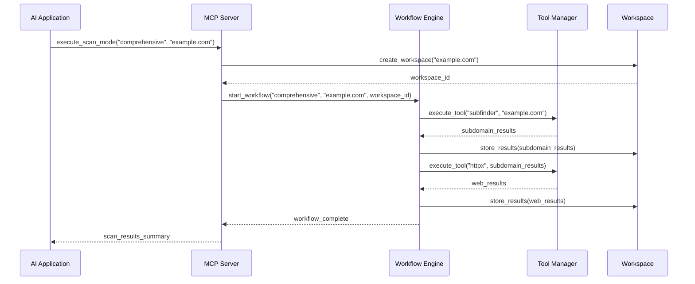
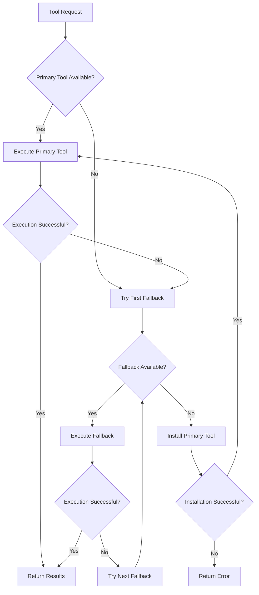
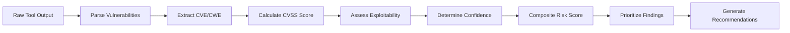

# Bug Bounty MCP Agent - Architecture V2

## Overview

The Bug Bounty MCP Agent is a sophisticated Model Context Protocol (MCP) server that provides AI applications with comprehensive security testing capabilities. This document outlines the enhanced architecture, implementation phases, and integration workflow with various AI platforms.

## Core Architecture

### 1. MCP Server Structure

```
bugbounty-mcp-agent/
├── mcp-servers/
│   ├── workflow/          # Scan orchestration engine
│   ├── tools/             # Tool management with fallbacks
│   ├── workspace/         # Persistent data storage
│   ├── risk/              # Vulnerability assessment
│   ├── recon/             # Reconnaissance MCP server
│   ├── scan/              # Scanning MCP server
│   ├── intel/             # Intelligence MCP server
│   └── report/            # Reporting MCP server
├── config/                # Configuration management
├── examples/              # Usage examples
└── docs/                  # Documentation
```

### 2. Core Components

#### A. Workflow Engine (`workflow/`)
- **Scan Modes**: Predefined workflows (Quick, Comprehensive, Stealth, Web-focused)
- **Orchestrator**: Manages tool execution, dependencies, and parallel processing
- **Tool Coordination**: Handles timeouts, rate limiting, and error recovery

#### B. Tool Manager (`tools/`)
- **Primary/Fallback System**: Automatic tool switching on failure
- **Tool Categories**: Subdomain enumeration, port scanning, web discovery, vulnerability scanning
- **Installation Management**: Automatic tool installation and verification

#### C. Workspace Manager (`workspace/`)
- **Persistent Storage**: SQLite database for scan results
- **Directory Structure**: Organized file system similar to Sn1per
- **Metadata Tracking**: Scan history, statistics, and lifecycle management

#### D. Risk Assessment (`risk/`)
- **CVSS Scoring**: Automated vulnerability severity calculation
- **Risk Prioritization**: Confidence-based vulnerability ranking
- **Threat Intelligence**: CVE/CWE correlation and exploitability assessment

## Implementation Phases

### Phase 1: Core Infrastructure ✅ COMPLETED
**Timeline**: Weeks 1-2

**Deliverables**:
- [x] Workflow engine with scan modes
- [x] Tool manager with fallback mechanisms
- [x] Workspace management system
- [x] Risk assessment framework

**Key Files**:
- `workflow/scan_modes.py` - Predefined scan workflows
- `workflow/orchestrator.py` - Execution engine
- `tools/tool_manager.py` - Tool management with fallbacks
- `workspace/manager.py` - Persistent storage system
- `risk/assessment.py` - CVSS-based risk scoring

### Phase 2: MCP Server Integration 🔄 IN PROGRESS
**Timeline**: Weeks 3-4

**Deliverables**:
- [ ] MCP server implementations for each module
- [ ] Tool exposure via MCP protocol
- [ ] Configuration management system
- [ ] Basic error handling and logging

**Target Tools**:
```python
# Reconnaissance MCP Server
- execute_scan_mode(mode, target, workspace)
- enumerate_subdomains(target, tools)
- discover_ports(target, scan_type)
- web_technology_detection(target)

# Scanning MCP Server
- vulnerability_scan(target, scan_type)
- nuclei_scan(target, templates)
- web_application_scan(target)
- service_enumeration(target, ports)

# Intelligence MCP Server
- correlate_vulnerabilities(findings)
- analyze_attack_surface(workspace)
- calculate_risk_score(vulnerabilities)
- generate_threat_intel(target)

# Workspace MCP Server
- create_workspace(name, target)
- list_workspaces()
- archive_workspace(workspace_id)
- export_results(workspace_id, format)

# Reporting MCP Server
- generate_report(workspace_id, template)
- create_executive_summary(workspace_id)
- export_findings(workspace_id, format)
```

### Phase 3: Tool Integration 📋 PLANNED
**Timeline**: Weeks 5-6

**Tool Integration Priority**:
1. **Subdomain Enumeration**: subfinder, assetfinder, amass, findomain
2. **Port Scanning**: nmap, masscan, rustscan
3. **Web Discovery**: httpx, waybackurls, dirsearch, gobuster
4. **Vulnerability Scanning**: nuclei, nikto, sqlmap
5. **Service Enumeration**: nmap scripts, whatweb, wappalyzer

### Phase 4: Advanced Features 🚀 PLANNED
**Timeline**: Weeks 7-8

**Features**:
- Advanced reporting with HTML/PDF generation
- Real-time scan monitoring and progress tracking
- Integration with external threat intelligence feeds
- Custom scan mode creation and sharing
- Notification system (Slack, Discord, email)

### Phase 5: Optimization & Scaling 🎯 PLANNED
**Timeline**: Weeks 9-10

**Optimizations**:
- Performance tuning and resource optimization
- Distributed scanning capabilities
- Advanced caching and result deduplication
- Enhanced error recovery and resilience

## Data Flow Architecture

### 1. Scan Initiation Flow



### 2. Tool Execution with Fallbacks



### 3. Risk Assessment Pipeline



## AI Application Integration

### 1. Claude Desktop Integration

**Setup Process**:
1. **Configuration**: Add MCP server to `claude_desktop_config.json`
```json
{
  "mcpServers": {
    "bugbounty-recon": {
      "command": "python",
      "args": ["/path/to/mcp-servers/recon/server.py"],
      "env": {
        "WORKSPACE_DIR": "/path/to/workspaces"
      }
    }
  }
}
```

2. **Usage Flow**:
```
User: "Perform a comprehensive security scan of example.com"
↓
Claude: Calls execute_scan_mode("comprehensive", "example.com")
↓
MCP Server: Orchestrates subfinder → httpx → nmap → nuclei
↓
Claude: Receives structured results and provides analysis
```

### 2. Gemini Integration

**Setup Process**:
1. **MCP Configuration**: Configure Gemini CLI with MCP server
2. **Tool Registration**: Register bug bounty tools with Gemini
3. **Workflow Integration**: Enable scan mode execution

**Usage Example**:
```
User: "I need to assess the security of my web application at app.example.com"
↓
Gemini: 
1. Creates workspace for app.example.com
2. Executes web-focused scan mode
3. Analyzes vulnerabilities found
4. Provides prioritized remediation steps
```

### 3. Generic MCP Client Integration

**Standard Integration Steps**:

1. **Server Discovery**:
   - MCP client discovers available bug bounty tools
   - Tools are categorized by function (recon, scan, intel, report)

2. **Capability Negotiation**:
   - Client queries available scan modes
   - Server responds with supported workflows and tools

3. **Execution Flow**:
   ```
   Client Request → MCP Server → Workflow Engine → Tool Manager → Results
   ```

4. **Result Processing**:
   - Structured data returned to client
   - AI processes and contextualizes findings
   - User receives actionable intelligence

## Step-by-Step Workflow Example

### Comprehensive Security Assessment

**Step 1: Initialization**
```
AI App: "Perform security assessment of example.com"
↓
MCP Call: execute_scan_mode("comprehensive", "example.com")
```

**Step 2: Workspace Creation**
```
Workspace Manager:
- Creates directory: /workspaces/example.com_20241201_143022/
- Initializes SQLite database
- Sets up subdirectories: subdomains/, ports/, web/, vulns/
```

**Step 3: Reconnaissance Phase**
```
Workflow Engine:
1. Subdomain Enumeration:
   - Primary: subfinder -d example.com
   - Fallback: assetfinder --subs-only example.com
   - Results: 47 subdomains discovered

2. Web Discovery:
   - httpx -l subdomains.txt -sc -title -tech-detect
   - Results: 23 live web services identified

3. Port Scanning:
   - nmap -sS -T4 -p- --top-ports 1000 example.com
   - Results: 8 open ports found
```

**Step 4: Vulnerability Assessment**
```
Tool Manager:
1. Nuclei Scanning:
   - nuclei -l live_hosts.txt -t /nuclei-templates/
   - Results: 12 vulnerabilities identified

2. Web Application Testing:
   - nikto -h https://example.com
   - Results: 5 web vulnerabilities found
```

**Step 5: Risk Analysis**
```
Risk Calculator:
1. CVSS Scoring:
   - SQL Injection: CVSS 8.1 (High)
   - XSS: CVSS 6.1 (Medium)
   - Info Disclosure: CVSS 4.3 (Medium)

2. Prioritization:
   - Critical: 1 finding
   - High: 3 findings
   - Medium: 8 findings
   - Low: 5 findings
```

**Step 6: Result Delivery**
```
AI App receives:
{
  "workspace_id": "example.com_20241201_143022",
  "scan_summary": {
    "total_subdomains": 47,
    "live_services": 23,
    "open_ports": 8,
    "vulnerabilities": 17
  },
  "risk_assessment": {
    "overall_score": 7.2,
    "critical_findings": 1,
    "high_findings": 3
  },
  "top_priorities": [
    {
      "type": "SQL Injection",
      "severity": "Critical",
      "cvss": 8.1,
      "location": "https://api.example.com/login"
    }
  ]
}
```

## Configuration Management

### Server Configuration
```yaml
# config/server.yaml
server:
  host: "localhost"
  port: 8000
  max_concurrent_scans: 5
  timeout: 3600

workspace:
  base_dir: "/opt/bugbounty-workspaces"
  retention_days: 30
  auto_archive: true

tools:
  install_missing: true
  update_check: daily
  timeout: 300

risk_assessment:
  cvss_version: "3.1"
  confidence_threshold: 0.7
  severity_weights:
    critical: 10.0
    high: 7.5
    medium: 5.0
    low: 2.5
```

### Tool Configuration
```yaml
# config/tools.yaml
tools:
  subdomain_enumeration:
    primary: "subfinder"
    fallbacks: ["assetfinder", "amass", "findomain"]
    timeout: 300
    
  port_scanning:
    primary: "nmap"
    fallbacks: ["masscan", "rustscan"]
    timeout: 600
    
  vulnerability_scanning:
    primary: "nuclei"
    fallbacks: ["nikto"]
    timeout: 1800
```

## Security Considerations

### 1. Tool Execution Safety
- Sandboxed execution environment
- Resource limits and timeouts
- Input validation and sanitization
- Privilege separation

### 2. Data Protection
- Encrypted workspace storage
- Secure credential management
- Audit logging
- Data retention policies

### 3. Network Security
- Rate limiting to prevent abuse
- IP whitelisting for sensitive operations
- TLS encryption for MCP communication
- Firewall integration

## Performance Optimization

### 1. Parallel Execution
- Concurrent tool execution where possible
- Dependency-aware scheduling
- Resource pool management

### 2. Caching Strategy
- Result caching for repeated scans
- Tool output deduplication
- Intelligent cache invalidation

### 3. Resource Management
- Memory usage monitoring
- Disk space management
- CPU throttling for intensive operations

## Monitoring and Observability

### 1. Metrics Collection
- Scan execution times
- Tool success/failure rates
- Resource utilization
- Error frequencies

### 2. Logging Strategy
- Structured logging with JSON format
- Log levels: DEBUG, INFO, WARN, ERROR
- Centralized log aggregation
- Security event logging

### 3. Health Checks
- Tool availability monitoring
- Database connectivity checks
- Workspace integrity validation
- Performance threshold alerts

## Future Enhancements

### 1. Machine Learning Integration
- False positive reduction
- Vulnerability correlation
- Threat intelligence enrichment
- Automated remediation suggestions

### 2. Cloud Integration
- AWS/GCP/Azure deployment
- Serverless execution options
- Container orchestration
- Auto-scaling capabilities

### 3. Community Features
- Custom scan mode sharing
- Community tool contributions
- Vulnerability database integration
- Collaborative workspaces

## Conclusion

The Bug Bounty MCP Agent represents a comprehensive security testing platform that seamlessly integrates with AI applications. Through its modular architecture, robust tool management, and intelligent workflow orchestration, it provides security professionals with powerful automation capabilities while maintaining flexibility and extensibility.

The phased implementation approach ensures steady progress while allowing for iterative improvements and community feedback. The integration with popular AI platforms like Claude Desktop and Gemini makes advanced security testing accessible to a broader audience of security professionals and developers.

---

*This document serves as the definitive architectural guide for the Bug Bounty MCP Agent. For implementation details, refer to the individual module documentation and code comments.*
