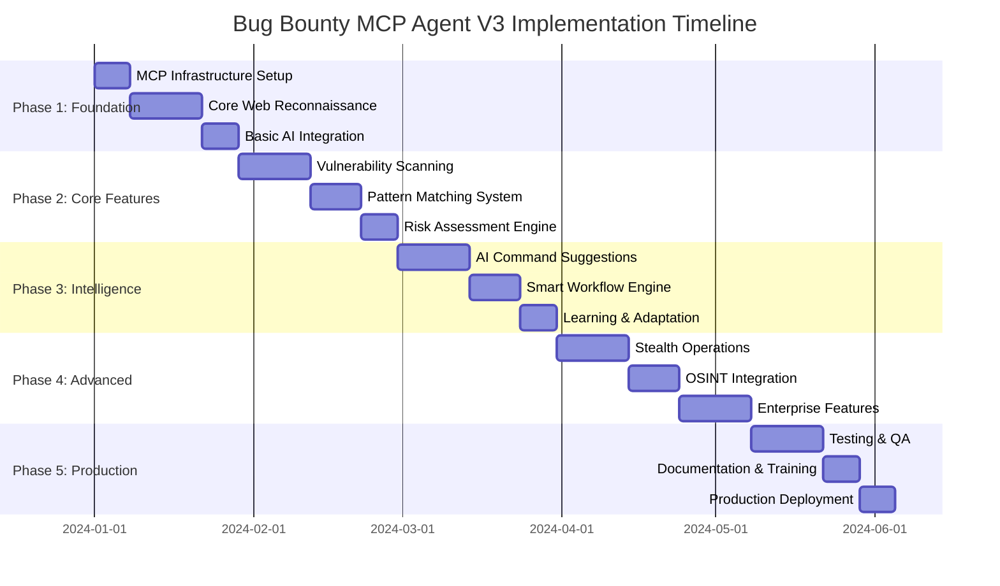
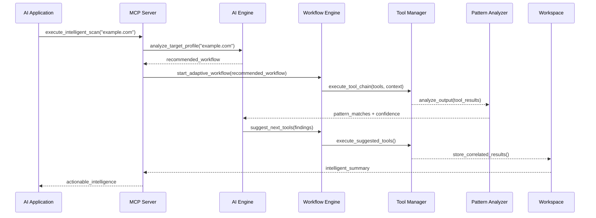
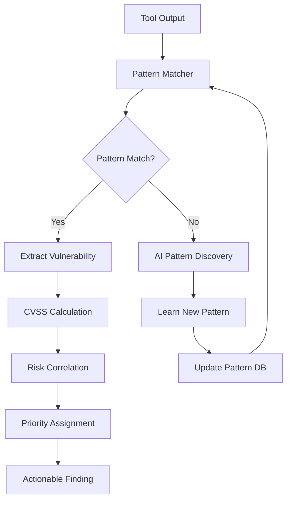
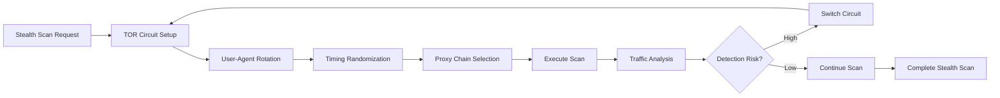

# Bug Bounty MCP Agent - Architecture V3

## Overview

The Bug Bounty MCP Agent V3 represents a significant evolution inspired by the analysis of the `Bug-Bounty-Automation` tool. This enhanced architecture incorporates AI-powered command suggestions, comprehensive web reconnaissance capabilities, stealth operations, and intelligent pattern matching to create a world-class security testing platform.

## Key Enhancements in V3

### 🚀 New Capabilities
- **AI-Enhanced Workflow Intelligence**: GPT-powered command suggestions and adaptive scanning
- **Comprehensive Web Reconnaissance**: Full HTTP toolkit with historical URL discovery
- **Stealth & Anonymity**: TOR integration, user-agent rotation, and evasion techniques
- **Pattern-Based Analysis**: Advanced vulnerability pattern matching with `gf` integration
- **Smart Tool Chaining**: Context-aware tool selection and dependency management
- **Real-time Risk Correlation**: Dynamic vulnerability assessment and prioritization

## Enhanced Architecture

### 1. MCP Server Structure (V3)

```
bugbounty-mcp-agent/
├── mcp-servers/
│   ├── workflow/          # Enhanced scan orchestration with AI
│   ├── tools/             # Expanded tool management (50+ tools)
│   ├── workspace/         # Advanced persistent storage with analytics
│   ├── risk/              # Enhanced CVSS + threat intelligence
│   ├── recon/             # Comprehensive reconnaissance suite
│   ├── web/               # NEW: Web-specific reconnaissance
│   ├── vuln/              # NEW: Vulnerability scanning engine
│   ├── osint/             # NEW: OSINT and intelligence gathering
│   ├── stealth/           # NEW: Anonymity and evasion tools
│   ├── ai/                # NEW: AI-powered analysis and suggestions
│   ├── patterns/          # NEW: Pattern matching and analysis
│   ├── intel/             # Enhanced intelligence correlation
│   └── report/            # Advanced reporting with visualizations
├── config/                # Enhanced configuration management
├── wordlists/             # Comprehensive wordlist collection
├── patterns/              # Vulnerability pattern definitions
├── ai-models/             # AI model configurations and prompts
└── docs/                  # Comprehensive documentation
```

### 2. Core Components (Enhanced)

#### A. AI-Enhanced Workflow Engine (`workflow/` + `ai/`)
- **Intelligent Scan Modes**: AI-driven workflow adaptation
- **Command Suggestion Engine**: GPT-powered next-step recommendations
- **Context-Aware Orchestration**: Dynamic tool selection based on findings
- **Learning Capabilities**: Workflow optimization from historical data

#### B. Comprehensive Tool Manager (`tools/`)
- **50+ Security Tools**: Complete coverage of reconnaissance to exploitation
- **Smart Fallback System**: Multi-tier tool alternatives with success prediction
- **Auto-Installation**: Intelligent tool setup and dependency management
- **Performance Monitoring**: Tool effectiveness tracking and optimization

#### C. Advanced Web Reconnaissance (`web/`)
- **HTTP Toolkit Integration**: httpx, waybackurls, gau, fff, meg
- **Content Discovery**: ffuf, dirsearch, gobuster with smart wordlists
- **Historical Analysis**: Archive.org integration and URL timeline analysis
- **Technology Detection**: Advanced fingerprinting and stack analysis

#### D. Stealth Operations (`stealth/`)
- **TOR Integration**: Automated proxy rotation and anonymity
- **Evasion Techniques**: User-agent rotation, rate limiting, timing randomization
- **Traffic Obfuscation**: Request pattern randomization and decoy traffic
- **Operational Security**: Anti-detection and attribution avoidance

#### E. Pattern-Based Analysis (`patterns/`)
- **GF Integration**: Advanced grep patterns for vulnerability detection
- **Custom Pattern Engine**: Extensible pattern matching framework
- **Real-time Analysis**: Live pattern matching during tool execution
- **Pattern Learning**: AI-enhanced pattern discovery and refinement

## Detailed Implementation Timeline & Phases (V3)

### 📅 **Master Timeline Overview**



## 📊 Current Implementation Status

### **Completed Phases**
- ✅ **Phase 0**: Initial Setup - **COMPLETED**
- ✅ **Phase 1 (Day 1)**: Enhanced MCP Server Foundation - **COMPLETED**
- ✅ **Phase 2 (Day 2)**: Smart Tool Manager Foundation - **COMPLETED**

### **Current Focus**
- 🔄 **Phase 3 (Day 3)**: Core Security Tools Integration - **40% COMPLETE**
  - ✅ Pattern Matching Engine Foundation implemented
  - ✅ Core pattern engine (`pattern_engine.py`) - 624 lines, fully implemented
  - ✅ GF integration and custom patterns framework
  - ✅ Most core tools registered: `gobuster`, `dirsearch`, `ffuf`, `waybackurls`, `gau`
  - ❌ Pattern files structure (`patterns/web/`, `patterns/api/` directories)
  - ❌ Missing tool registrations: `whatweb`, `wappalyzer`, `meg`
  - ❌ Pattern engine integration with tool orchestration

### **Upcoming Phases**
- ⏳ **Phase 4**: Advanced Vulnerability Scanning - **PLANNED**
- ⏳ **Phase 5**: Stealth Operations & Advanced Features - **PLANNED**

---

### Phase 1: Foundation & Core Web Reconnaissance ⚡ **CRITICAL PATH**
**Timeline**: Weeks 1-4 (28 days)
**Priority**: P0 - Blocking for all other phases

#### Week 1: MCP Infrastructure Setup
**Days 1-7**

**Sprint Goals**:
- [ ] **Day 1-2**: MCP server architecture setup
- [ ] **Day 3-4**: Claude Desktop integration
- [ ] **Day 5-6**: Gemini CLI integration
- [ ] **Day 7**: Basic testing and validation

**Detailed Tasks**:
```yaml
Infrastructure Setup:
  - Create MCP server base classes and interfaces
  - Implement server discovery and registration
  - Setup logging and error handling framework
  - Create configuration management system
  
AI Client Integration:
  - Configure Claude Desktop MCP connections
  - Setup Gemini CLI with MCP support
  - Test basic MCP communication protocols
  - Validate tool discovery and execution
  
Deliverables:
  - Working MCP server framework
  - AI client configurations
  - Basic integration tests
  - Setup documentation
```

#### Weeks 2-3: Core Web Reconnaissance
**Days 8-21**

**Critical Tools Integration**:
```python
# Web Reconnaissance MCP Server Implementation
class WebReconServer:
    async def probe_live_hosts(self, targets: List[str], threads: int = 50) -> Dict:
        """httpx integration for live host discovery"""
        
    async def discover_historical_urls(self, domain: str, years: int = 5) -> List[str]:
        """waybackurls + gau integration"""
        
    async def enumerate_content(self, targets: List[str], wordlists: List[str]) -> Dict:
        """ffuf + dirsearch + gobuster integration"""
        
    async def analyze_technologies(self, urls: List[str]) -> Dict:
        """whatweb + wappalyzer integration"""
        
    async def extract_endpoints(self, urls: List[str], patterns: List[str]) -> List[str]:
        """custom endpoint extraction with gf patterns"""
```

**Sprint Breakdown**:
- **Week 2 (Days 8-14)**: HTTP toolkit (httpx, fff, meg)
- **Week 3 (Days 15-21)**: Content discovery (ffuf, dirsearch, gobuster)

#### Week 4: Basic AI Integration
**Days 22-28**

**AI Enhancement Foundation**:
```python
class BasicAIIntegration:
    async def suggest_next_tools(self, scan_context: Dict) -> List[str]:
        """Basic GPT-powered tool suggestions"""
        
    async def analyze_scan_results(self, results: Dict) -> Dict:
        """Initial AI-powered result analysis"""
```

**Deliverables**:
- ✅ HTTP toolkit integration (httpx, fff, meg)
- ✅ Historical URL discovery (waybackurls, gau)
- ✅ Content discovery engine (ffuf, dirsearch, gobuster)
- ✅ Technology detection and fingerprinting
- ✅ Basic AI command suggestions

### Phase 2: Vulnerability Scanning Engine 🔍 **HIGH PRIORITY**
**Timeline**: Weeks 5-7 (21 days)
**Priority**: P1 - Core security functionality

#### Week 5: Modern Vulnerability Scanning
**Days 29-35**

**Vulnerability Tools Implementation**:
```python
class VulnerabilityScanner:
    async def nuclei_scan(self, targets: List[str], templates: List[str], severity: List[str]) -> Dict:
        """Modern vulnerability scanner with nuclei templates"""
        
    async def web_vulnerability_scan(self, urls: List[str], scan_types: List[str]) -> Dict:
        """nikto + custom web vulnerability testing"""
        
    async def sql_injection_test(self, endpoints: List[str], payloads: List[str]) -> Dict:
        """sqlmap integration for SQL injection testing"""
        
    async def xss_detection(self, forms: List[Dict], parameters: List[str]) -> Dict:
        """dalfox integration for XSS detection"""
```

#### Week 6: Advanced Scanning Capabilities
**Days 36-42**

**Advanced Scanning Features**:
```python
class AdvancedScanning:
    async def authenticated_scan(self, targets: List[str], credentials: Dict) -> Dict:
        """Authenticated vulnerability testing"""
        
    async def api_security_test(self, endpoints: List[str], schemas: List[Dict]) -> Dict:
        """API-specific security assessment"""
        
    async def ssl_tls_analysis(self, hosts: List[str], protocols: List[str]) -> Dict:
        """SSL/TLS configuration analysis"""
```

#### Week 7: Pattern Matching & Risk Assessment
**Days 43-49**

**Pattern Intelligence System**:
```python
class PatternMatchingEngine:
    async def apply_gf_patterns(self, tool_outputs: List[str]) -> List[Dict]:
        """Apply gf patterns for vulnerability detection"""
        
    async def custom_pattern_matching(self, data: str, patterns: List[str]) -> List[Dict]:
        """Custom pattern matching engine"""
        
    async def learn_new_patterns(self, findings: List[Dict]) -> List[str]:
        """AI-powered pattern discovery"""
```

### Phase 3: AI-Powered Intelligence 🧠 **INNOVATION PHASE**
**Timeline**: Weeks 8-10 (21 days)
**Priority**: P2 - Competitive advantage features

#### Week 8: Advanced AI Command Suggestions
**Days 50-56**

**AI Enhancement Features**:
```python
class AdvancedAIEngine:
    async def suggest_next_commands(self, scan_history: List[Dict], findings: List[Dict]) -> List[Dict]:
        """GPT-4 powered intelligent command suggestions"""
        
    async def correlate_vulnerabilities(self, findings: List[Dict], context: Dict) -> Dict:
        """Intelligent vulnerability correlation"""
        
    async def predict_attack_vectors(self, target_profile: Dict) -> List[Dict]:
        """Attack path prediction using AI"""
```

#### Week 9: Smart Workflow Engine
**Days 57-63**

**Workflow Intelligence**:
```python
class SmartWorkflowEngine:
    async def optimize_scan_workflow(self, target_characteristics: Dict) -> Dict:
        """AI-optimized workflow generation"""
        
    async def adaptive_tool_selection(self, scan_context: Dict) -> List[str]:
        """Context-aware tool selection"""
        
    async def dynamic_resource_allocation(self, active_scans: List[Dict]) -> Dict:
        """Intelligent resource management"""
```

#### Week 10: Learning & Adaptation
**Days 64-70**

**Learning Capabilities**:
```python
class LearningEngine:
    async def learn_from_scan_results(self, scan_results: List[Dict]) -> Dict:
        """Learn patterns from successful scans"""
        
    async def update_tool_effectiveness(self, tool_results: Dict) -> None:
        """Track and improve tool effectiveness"""
        
    async def personalize_workflows(self, user_preferences: Dict) -> Dict:
        """Personalized workflow recommendations"""
```

### Phase 4: Stealth & OSINT Operations 🕵️ **ADVANCED FEATURES**
**Timeline**: Weeks 11-13 (21 days)
**Priority**: P3 - Advanced operational capabilities

#### Week 11: Stealth Operations
**Days 71-77**

**Stealth Capabilities**:
```python
class StealthOperations:
    async def tor_scan_mode(self, targets: List[str], exit_nodes: List[str]) -> Dict:
        """TOR-enabled anonymous scanning"""
        
    async def evasion_scan(self, targets: List[str], evasion_level: int) -> Dict:
        """Anti-detection scanning techniques"""
        
    async def distributed_scan(self, targets: List[str], proxy_pool: List[str]) -> Dict:
        """Distributed reconnaissance across proxies"""
        
    async def timing_evasion(self, scan_config: Dict, randomization: Dict) -> Dict:
        """Timing-based evasion techniques"""
```

#### Week 12: OSINT Integration
**Days 78-84**

**OSINT Capabilities**:
```python
class OSINTIntegration:
    async def shodan_intelligence(self, targets: List[str], api_key: str) -> Dict:
        """Shodan API integration for intelligence gathering"""
        
    async def censys_analysis(self, targets: List[str], certificates: bool) -> Dict:
        """Censys platform integration"""
        
    async def social_media_osint(self, target_org: str, platforms: List[str]) -> Dict:
        """Social media intelligence gathering"""
        
    async def certificate_transparency(self, domains: List[str], logs: List[str]) -> Dict:
        """Certificate transparency log analysis"""
```

#### Week 13: Enterprise Features
**Days 85-91**

**Enterprise Capabilities**:
```python
class EnterpriseFeatures:
    async def attack_surface_analysis(self, workspace_id: str) -> Dict:
        """Comprehensive attack surface mapping"""
        
    async def threat_modeling(self, assets: List[Dict], vulnerabilities: List[Dict]) -> Dict:
        """Automated threat modeling"""
        
    async def compliance_assessment(self, findings: List[Dict], frameworks: List[str]) -> Dict:
        """Compliance gap analysis"""
        
    async def executive_dashboard(self, workspace_id: str, metrics: List[str]) -> Dict:
        """Executive-level reporting and dashboards"""
```

### Phase 5: Production Readiness 📊 **DEPLOYMENT PHASE**
**Timeline**: Weeks 14-16 (21 days)
**Priority**: P1 - Production deployment

#### Week 14: Comprehensive Testing & QA
**Days 92-98**

**Testing Strategy**:
```yaml
Testing Framework:
  Unit Tests:
    - Individual tool integrations
    - MCP server functionality
    - AI integration components
    
  Integration Tests:
    - End-to-end workflow testing
    - AI client compatibility
    - Multi-server coordination
    
  Performance Tests:
    - Load testing with multiple targets
    - Resource utilization optimization
    - Scalability validation
    
  Security Tests:
    - Stealth operation validation
    - Data protection verification
    - Access control testing
```

#### Week 15: Documentation & Training
**Days 99-105**

**Documentation Deliverables**:
- 📚 **User Manual**: Complete usage guide with examples
- 🔧 **API Documentation**: Comprehensive MCP tool reference
- 🎯 **Best Practices Guide**: Security and operational guidelines
- 🎓 **Training Materials**: Video tutorials and workshops
- 🚀 **Quick Start Guide**: 15-minute setup and first scan

#### Week 16: Production Deployment
**Days 106-112**

**Deployment Strategy**:
```yaml
Deployment Plan:
  Beta Release (Days 106-108):
    - Limited user testing
    - Feedback collection
    - Critical bug fixes
    
  Release Candidate (Days 109-110):
    - Final testing
    - Performance optimization
    - Documentation finalization
    
  Production Release (Days 111-112):
    - Public release
    - Community announcement
    - Support infrastructure activation
```

## 📊 **Resource Allocation & Team Structure**

### Development Team Structure
```yaml
Core Team (6 developers):
  Technical Lead (1):
    - Architecture oversight
    - Code review and quality
    - Technical decision making
    
  Backend Developers (2):
    - MCP server implementation
    - Tool integration
    - Database and storage
    
  AI/ML Engineers (2):
    - AI integration and optimization
    - Pattern learning systems
    - Intelligent workflow engine
    
  Security Engineer (1):
    - Stealth operations
    - Security testing
    - Vulnerability assessment
    
Support Team (3 members):
  DevOps Engineer (1):
    - CI/CD pipeline
    - Infrastructure management
    - Deployment automation
    
  QA Engineer (1):
    - Testing strategy
    - Quality assurance
    - Performance testing
    
  Technical Writer (1):
    - Documentation
    - Training materials
    - User guides
```

### Budget Estimation
```yaml
Development Costs (16 weeks):
  Personnel (9 team members): $720,000
  Infrastructure & Tools: $25,000
  AI API Costs (GPT-4, etc.): $15,000
  Security Tools & Licenses: $30,000
  Testing & QA Infrastructure: $20,000
  
Total Estimated Cost: $810,000

Ongoing Operational Costs (monthly):
  Infrastructure: $5,000
  AI API Usage: $3,000
  Tool Licenses: $2,000
  Support & Maintenance: $15,000
  
Total Monthly: $25,000
```

## 🎯 **Success Metrics & KPIs**

### Technical Metrics
```yaml
Performance KPIs:
  - Tool execution time < 30s average
  - AI suggestion accuracy > 85%
  - System uptime > 99.5%
  - Memory usage < 2GB per scan
  
Quality Metrics:
  - Code coverage > 90%
  - Bug density < 1 per 1000 LOC
  - Security vulnerability count = 0
  - Documentation completeness > 95%
```

### User Experience Metrics
```yaml
Usability KPIs:
  - Setup time < 15 minutes
  - First successful scan < 5 minutes
  - User satisfaction score > 4.5/5
  - Community adoption > 1000 users in 3 months
```

## 🚨 **Risk Management & Mitigation**

### High-Risk Items
```yaml
Technical Risks:
  AI Integration Complexity:
    Risk: GPT-4 API limitations or changes
    Mitigation: Multi-model support, fallback systems
    
  Tool Integration Challenges:
    Risk: External tool compatibility issues
    Mitigation: Containerization, version pinning
    
  Performance Scalability:
    Risk: System performance under load
    Mitigation: Early performance testing, optimization
    
Business Risks:
  Timeline Delays:
    Risk: Feature complexity underestimation
    Mitigation: Agile methodology, regular reviews
    
  Resource Constraints:
    Risk: Team availability or budget limitations
    Mitigation: Flexible scope, MVP approach
```

### Contingency Plans
```yaml
Contingency Strategies:
  Scope Reduction:
    - Phase 4 & 5 features can be delayed
    - AI features can be simplified
    - Enterprise features are optional
    
  Resource Reallocation:
    - Cross-training team members
    - External contractor support
    - Community contribution integration
    
  Technical Alternatives:
    - Simplified AI integration
    - Manual workflow alternatives
    - Reduced tool integration scope
```

## Enhanced Data Flow Architecture

### 1. AI-Enhanced Scan Flow



### 2. Pattern-Based Analysis Flow



### 3. Stealth Operation Flow



## New MCP Tools (V3)

### Web Reconnaissance Tools
```python
# HTTP and Web Discovery
web_tools = [
    Tool(name="probe_live_hosts", description="Probe live HTTP/HTTPS hosts with httpx"),
    Tool(name="discover_historical_urls", description="Extract URLs from Wayback Machine"),
    Tool(name="enumerate_content", description="Discover hidden content with ffuf/dirsearch"),
    Tool(name="analyze_technologies", description="Identify web technologies and versions"),
    Tool(name="extract_endpoints", description="Extract API endpoints and parameters"),
    Tool(name="batch_http_requests", description="Perform batch HTTP requests with fff"),
    Tool(name="multi_host_requests", description="Send requests to multiple hosts with meg")
]
```

### Vulnerability Scanning Tools
```python
# Vulnerability Assessment
vuln_tools = [
    Tool(name="nuclei_scan", description="Modern vulnerability scanner with templates"),
    Tool(name="web_vulnerability_scan", description="Web application vulnerability testing"),
    Tool(name="sql_injection_test", description="SQL injection testing with sqlmap"),
    Tool(name="xss_detection", description="XSS vulnerability detection with dalfox"),
    Tool(name="cms_vulnerability_scan", description="CMS-specific vulnerability testing"),
    Tool(name="api_security_test", description="API security assessment"),
    Tool(name="ssl_tls_analysis", description="SSL/TLS configuration analysis")
]
```

### AI-Enhanced Tools
```python
# AI-Powered Analysis
ai_tools = [
    Tool(name="suggest_next_commands", description="AI-powered command suggestions"),
    Tool(name="correlate_vulnerabilities", description="Intelligent vulnerability correlation"),
    Tool(name="predict_attack_vectors", description="Attack path prediction"),
    Tool(name="generate_custom_payloads", description="AI payload generation"),
    Tool(name="optimize_scan_workflow", description="Workflow optimization"),
    Tool(name="classify_findings", description="AI-powered finding classification")
]
```

### Stealth Operation Tools
```python
# Stealth and Evasion
stealth_tools = [
    Tool(name="tor_scan_mode", description="TOR-enabled anonymous scanning"),
    Tool(name="evasion_scan", description="Anti-detection scanning techniques"),
    Tool(name="distributed_scan", description="Distributed reconnaissance"),
    Tool(name="timing_evasion", description="Timing-based evasion"),
    Tool(name="proxy_rotation", description="Automated proxy rotation"),
    Tool(name="traffic_obfuscation", description="Traffic pattern obfuscation")
]
```

### OSINT and Intelligence Tools
```python
# OSINT and Threat Intelligence
osint_tools = [
    Tool(name="shodan_intelligence", description="Shodan API integration"),
    Tool(name="censys_analysis", description="Censys platform integration"),
    Tool(name="certificate_transparency", description="CT log analysis"),
    Tool(name="social_media_osint", description="Social media intelligence"),
    Tool(name="threat_intelligence", description="Threat intel correlation"),
    Tool(name="dark_web_monitoring", description="Dark web intelligence")
]
```

## AI Integration Architecture

### 1. Command Suggestion Engine
```python
class AICommandSuggester:
    def __init__(self, model="gpt-4"):
        self.model = model
        self.context_analyzer = ContextAnalyzer()
        self.command_history = CommandHistory()
    
    async def suggest_next_commands(self, scan_context: Dict) -> List[Command]:
        """
        Analyze current scan state and suggest optimal next commands
        """
        context = self.context_analyzer.analyze(scan_context)
        history = self.command_history.get_relevant_history(context)
        
        prompt = self._build_suggestion_prompt(context, history)
        suggestions = await self._query_ai_model(prompt)
        
        return self._parse_and_validate_suggestions(suggestions)
    
    def _build_suggestion_prompt(self, context: Dict, history: List) -> str:
        return f"""
        You are an expert bug bounty hunter analyzing a target.
        
        Current Context:
        - Target: {context['target']}
        - Discovered Assets: {context['assets']}
        - Current Findings: {context['findings']}
        - Tools Used: {context['tools_used']}
        
        Based on this context and your expertise, suggest the next 3-5 most 
        effective commands to run. Consider:
        1. Logical progression from current findings
        2. Maximum impact potential
        3. Efficiency and time optimization
        4. Coverage gaps in current assessment
        
        Provide specific commands with parameters and reasoning.
        """
```

### 2. Pattern Learning System
```python
class PatternLearningEngine:
    def __init__(self):
        self.pattern_db = PatternDatabase()
        self.ml_classifier = VulnerabilityClassifier()
        self.confidence_calculator = ConfidenceCalculator()
    
    async def analyze_and_learn(self, tool_output: str, tool_name: str) -> List[Finding]:
        """
        Analyze tool output, extract findings, and learn new patterns
        """
        # Apply existing patterns
        known_findings = self.pattern_db.match_patterns(tool_output)
        
        # Use ML to discover potential new vulnerabilities
        ml_findings = await self.ml_classifier.classify(tool_output)
        
        # Learn new patterns from high-confidence ML findings
        new_patterns = self._extract_patterns(ml_findings, confidence_threshold=0.8)
        await self.pattern_db.add_patterns(new_patterns)
        
        # Combine and rank all findings
        all_findings = known_findings + ml_findings
        return self._rank_by_confidence(all_findings)
```

### 3. Intelligent Risk Correlation
```python
class IntelligentRiskCorrelator:
    def __init__(self):
        self.threat_intel = ThreatIntelligenceAPI()
        self.exploit_db = ExploitDatabase()
        self.cvss_calculator = EnhancedCVSSCalculator()
    
    async def correlate_and_prioritize(self, findings: List[Finding]) -> List[PrioritizedFinding]:
        """
        Correlate findings with threat intelligence and calculate dynamic risk scores
        """
        prioritized = []
        
        for finding in findings:
            # Get threat intelligence context
            threat_context = await self.threat_intel.get_context(finding)
            
            # Check for active exploits
            exploit_info = await self.exploit_db.check_exploits(finding)
            
            # Calculate dynamic CVSS score
            dynamic_cvss = self.cvss_calculator.calculate_dynamic_score(
                finding, threat_context, exploit_info
            )
            
            # Create prioritized finding
            prioritized_finding = PrioritizedFinding(
                finding=finding,
                dynamic_risk_score=dynamic_cvss,
                threat_context=threat_context,
                exploit_availability=exploit_info,
                priority_rank=self._calculate_priority_rank(dynamic_cvss, threat_context)
            )
            
            prioritized.append(prioritized_finding)
        
        return sorted(prioritized, key=lambda x: x.priority_rank, reverse=True)
```

## MCP Integration & AI Client Setup

### 1. Claude Desktop Integration

#### Claude Desktop Configuration
```json
// ~/.config/claude_desktop/claude_desktop_config.json
{
  "mcpServers": {
    "bugbounty-recon": {
      "command": "python",
      "args": [
        "/home/kali/AI/developing/bugbounty-mcp-agent/mcp-servers/recon/recon_server.py"
      ],
      "env": {
        "PYTHONPATH": "/home/kali/AI/developing/bugbounty-mcp-agent",
        "MCP_LOG_LEVEL": "INFO"
      }
    },
    "bugbounty-workflow": {
      "command": "python",
      "args": [
        "/home/kali/AI/developing/bugbounty-mcp-agent/mcp-servers/workflow/orchestrator.py"
      ],
      "env": {
        "PYTHONPATH": "/home/kali/AI/developing/bugbounty-mcp-agent",
        "OPENAI_API_KEY": "${OPENAI_API_KEY}"
      }
    },
    "bugbounty-web": {
      "command": "python",
      "args": [
        "/home/kali/AI/developing/bugbounty-mcp-agent/mcp-servers/web/web_server.py"
      ],
      "env": {
        "PYTHONPATH": "/home/kali/AI/developing/bugbounty-mcp-agent"
      }
    },
    "bugbounty-vuln": {
      "command": "python",
      "args": [
        "/home/kali/AI/developing/bugbounty-mcp-agent/mcp-servers/vuln/vuln_server.py"
      ],
      "env": {
        "PYTHONPATH": "/home/kali/AI/developing/bugbounty-mcp-agent"
      }
    },
    "bugbounty-stealth": {
      "command": "python",
      "args": [
        "/home/kali/AI/developing/bugbounty-mcp-agent/mcp-servers/stealth/stealth_server.py"
      ],
      "env": {
        "PYTHONPATH": "/home/kali/AI/developing/bugbounty-mcp-agent",
        "TOR_CONTROL_PORT": "9051",
        "TOR_SOCKS_PORT": "9050"
      }
    },
    "bugbounty-ai": {
      "command": "python",
      "args": [
        "/home/kali/AI/developing/bugbounty-mcp-agent/mcp-servers/ai/ai_server.py"
      ],
      "env": {
        "PYTHONPATH": "/home/kali/AI/developing/bugbounty-mcp-agent",
        "OPENAI_API_KEY": "${OPENAI_API_KEY}",
        "ANTHROPIC_API_KEY": "${ANTHROPIC_API_KEY}"
      }
    },
    "bugbounty-risk": {
      "command": "python",
      "args": [
        "/home/kali/AI/developing/bugbounty-mcp-agent/mcp-servers/risk/assessment.py"
      ],
      "env": {
        "PYTHONPATH": "/home/kali/AI/developing/bugbounty-mcp-agent"
      }
    },
    "bugbounty-workspace": {
      "command": "python",
      "args": [
        "/home/kali/AI/developing/bugbounty-mcp-agent/mcp-servers/workspace/manager.py"
      ],
      "env": {
        "PYTHONPATH": "/home/kali/AI/developing/bugbounty-mcp-agent",
        "WORKSPACE_ROOT": "/home/kali/AI/developing/bugbounty-mcp-agent/workspaces"
      }
    }
  }
}
```

### 2. Gemini CLI Integration

#### Gemini CLI Configuration
```json
// ~/.config/gemini-cli/settings.json
{
  "mcp": {
    "enabled": true,
    "servers": {
      "bugbounty-suite": {
        "command": "python",
        "args": [
          "/home/kali/AI/developing/bugbounty-mcp-agent/mcp-servers/main_server.py"
        ],
        "env": {
          "PYTHONPATH": "/home/kali/AI/developing/bugbounty-mcp-agent",
          "GEMINI_API_KEY": "${GEMINI_API_KEY}",
          "OPENAI_API_KEY": "${OPENAI_API_KEY}"
        },
        "timeout": 30000,
        "retry_attempts": 3
      }
    }
  },
  "ai_enhancement": {
    "command_suggestion": true,
    "auto_correlation": true,
    "smart_workflows": true
  }
}
```

#### Gemini CLI Setup Script
```bash
#!/bin/bash
# scripts/setup_gemini_cli_v3.sh

echo "Setting up Gemini CLI for Bug Bounty MCP Agent V3..."

# Install Gemini CLI if not present
if ! command -v gemini-cli &> /dev/null; then
    echo "Installing Gemini CLI..."
    npm install -g @google/generative-ai-cli
fi

# Create configuration directory
mkdir -p ~/.config/gemini-cli

# Copy configuration
cp config/gemini_cli_config_v3.json ~/.config/gemini-cli/settings.json

# Set environment variables
echo "export GEMINI_API_KEY='your_gemini_api_key_here'" >> ~/.bashrc
echo "export OPENAI_API_KEY='your_openai_api_key_here'" >> ~/.bashrc
echo "export ANTHROPIC_API_KEY='your_anthropic_api_key_here'" >> ~/.bashrc

# Test MCP connection
echo "Testing MCP connection..."
gemini-cli test-mcp bugbounty-suite

echo "Gemini CLI setup complete!"
```

### 3. Other AI Client Integrations

#### Cursor IDE Integration
```json
// .cursor/mcp_config.json
{
  "mcpServers": {
    "bugbounty-agent": {
      "command": "python",
      "args": ["-m", "mcp_servers.main"],
      "cwd": "/home/kali/AI/developing/bugbounty-mcp-agent",
      "env": {
        "PYTHONPATH": "/home/kali/AI/developing/bugbounty-mcp-agent"
      }
    }
  }
}
```

#### Continue.dev Integration
```json
// .continue/config.json
{
  "models": [
    {
      "title": "GPT-4 with Bug Bounty MCP",
      "provider": "openai",
      "model": "gpt-4",
      "mcp": {
        "servers": [
          {
            "name": "bugbounty-agent",
            "command": "python",
            "args": [
              "/home/kali/AI/developing/bugbounty-mcp-agent/mcp-servers/main_server.py"
            ]
          }
        ]
      }
    }
  ]
}
```

#### Trae AI Integration
```json
// trae_config.json
{
  "mcp_servers": {
    "bugbounty": {
      "path": "/home/kali/AI/developing/bugbounty-mcp-agent/mcp-servers/main_server.py",
      "python_path": "/home/kali/AI/developing/bugbounty-mcp-agent",
      "auto_start": true,
      "capabilities": [
        "reconnaissance",
        "vulnerability_scanning",
        "workflow_orchestration",
        "ai_enhancement",
        "stealth_operations"
      ]
    }
  }
}
```

## Enhanced Configuration

### AI Configuration
```yaml
# config/ai.yaml
ai:
  command_suggestion:
    model: "gpt-4"
    max_suggestions: 5
    confidence_threshold: 0.7
    context_window: 10
    
  pattern_learning:
    enabled: true
    learning_threshold: 0.8
    auto_update_patterns: true
    pattern_validation: true
    
  risk_correlation:
    threat_intel_sources:
      - "mitre_attack"
      - "cve_database"
      - "exploit_db"
    correlation_confidence: 0.6
    dynamic_scoring: true
```

### Stealth Configuration
```yaml
# config/stealth.yaml
stealth:
  tor:
    enabled: false
    control_port: 9051
    socks_port: 9050
    circuit_timeout: 300
    
  evasion:
    user_agent_rotation: true
    timing_randomization: true
    request_spacing: "1-5s"
    decoy_requests: false
    
  proxy:
    rotation_enabled: true
    proxy_sources:
      - "free_proxy_list"
      - "custom_proxy_pool"
    health_check_interval: 60
```

### Tool Configuration (Enhanced)
```yaml
# config/tools_v3.yaml
tools:
  web_reconnaissance:
    httpx:
      threads: 50
      timeout: 10
      follow_redirects: true
      tech_detect: true
      
    waybackurls:
      years: 5
      no_subs: false
      
    ffuf:
      threads: 40
      timeout: 10
      wordlists:
        - "common.txt"
        - "raft-medium-directories.txt"
        
  vulnerability_scanning:
    nuclei:
      templates_dir: "/opt/nuclei-templates"
      severity: ["medium", "high", "critical"]
      rate_limit: 150
      
    sqlmap:
      risk: 1
      level: 1
      timeout: 30
      
  ai_enhancement:
    openai_api_key: "${OPENAI_API_KEY}"
    model_preferences:
      suggestion: "gpt-4"
      analysis: "gpt-3.5-turbo"
      classification: "gpt-4"
```

## Security Enhancements

### 1. Advanced Operational Security
- **Attribution Avoidance**: Multi-layer anonymization with TOR + VPN + proxy chains
- **Traffic Analysis Resistance**: Timing randomization and decoy traffic generation
- **Fingerprint Evasion**: Dynamic user-agent rotation and request header randomization
- **Detection Avoidance**: Intelligent rate limiting and behavioral pattern variation

### 2. Data Protection
- **End-to-End Encryption**: All scan data encrypted at rest and in transit
- **Secure Key Management**: Hardware security module (HSM) integration
- **Zero-Knowledge Architecture**: Client-side encryption with server-side processing
- **Audit Trail**: Comprehensive logging with tamper-evident storage

### 3. Access Control
- **Role-Based Access Control (RBAC)**: Granular permissions for team environments
- **Multi-Factor Authentication**: Hardware token and biometric support
- **API Security**: OAuth 2.0 + JWT with scope-based access control
- **Network Segmentation**: Isolated execution environments for sensitive scans

## Performance Optimizations (V3)

### 1. Intelligent Parallelization
```python
class IntelligentParallelizer:
    def __init__(self):
        self.resource_monitor = ResourceMonitor()
        self.dependency_graph = DependencyGraph()
        self.performance_predictor = PerformancePredictor()
    
    async def optimize_execution(self, tools: List[Tool]) -> ExecutionPlan:
        # Analyze system resources
        available_resources = self.resource_monitor.get_available_resources()
        
        # Build dependency graph
        dependency_graph = self.dependency_graph.build(tools)
        
        # Predict execution times
        time_predictions = self.performance_predictor.predict_times(tools)
        
        # Generate optimal execution plan
        return self._generate_execution_plan(
            tools, dependency_graph, time_predictions, available_resources
        )
```

### 2. Advanced Caching Strategy
```python
class IntelligentCache:
    def __init__(self):
        self.cache_layers = {
            'memory': MemoryCache(ttl=3600),
            'disk': DiskCache(ttl=86400),
            'distributed': RedisCache(ttl=604800)
        }
        self.cache_predictor = CachePredictionEngine()
    
    async def get_or_compute(self, cache_key: str, compute_func: Callable) -> Any:
        # Check cache layers in order of speed
        for layer_name, cache_layer in self.cache_layers.items():
            result = await cache_layer.get(cache_key)
            if result is not None:
                # Promote to faster cache layers
                await self._promote_to_faster_layers(cache_key, result, layer_name)
                return result
        
        # Compute result and cache intelligently
        result = await compute_func()
        await self._intelligent_cache_store(cache_key, result)
        return result
```

### 3. Resource Management
```python
class AdaptiveResourceManager:
    def __init__(self):
        self.resource_monitor = SystemResourceMonitor()
        self.workload_predictor = WorkloadPredictor()
        self.auto_scaler = AutoScaler()
    
    async def manage_resources(self, active_scans: List[Scan]) -> ResourceAllocation:
        # Monitor current resource usage
        current_usage = self.resource_monitor.get_current_usage()
        
        # Predict resource needs
        predicted_needs = self.workload_predictor.predict_needs(active_scans)
        
        # Auto-scale if needed
        if predicted_needs > current_usage.available:
            await self.auto_scaler.scale_up(predicted_needs - current_usage.available)
        
        # Allocate resources optimally
        return self._allocate_resources(active_scans, current_usage)
```

## Monitoring and Observability (Enhanced)

### 1. Real-time Analytics Dashboard
```python
class RealTimeAnalytics:
    def __init__(self):
        self.metrics_collector = MetricsCollector()
        self.anomaly_detector = AnomalyDetector()
        self.alert_manager = AlertManager()
    
    async def monitor_scan_health(self, scan_id: str) -> ScanHealthMetrics:
        metrics = await self.metrics_collector.collect_scan_metrics(scan_id)
        
        # Detect anomalies
        anomalies = self.anomaly_detector.detect(metrics)
        
        # Send alerts if needed
        if anomalies:
            await self.alert_manager.send_alerts(scan_id, anomalies)
        
        return ScanHealthMetrics(
            scan_id=scan_id,
            performance_metrics=metrics,
            anomalies=anomalies,
            health_score=self._calculate_health_score(metrics, anomalies)
        )
```

### 2. Predictive Maintenance
```python
class PredictiveMaintenance:
    def __init__(self):
        self.failure_predictor = FailurePredictor()
        self.maintenance_scheduler = MaintenanceScheduler()
        self.health_assessor = HealthAssessor()
    
    async def predict_and_schedule_maintenance(self) -> MaintenancePlan:
        # Assess current system health
        health_assessment = await self.health_assessor.assess_system_health()
        
        # Predict potential failures
        failure_predictions = self.failure_predictor.predict_failures(health_assessment)
        
        # Schedule preventive maintenance
        maintenance_plan = self.maintenance_scheduler.schedule_maintenance(
            failure_predictions, health_assessment
        )
        
        return maintenance_plan
```

## 🛠️ **Setup & Deployment Automation**

### Automated Setup Scripts

#### Complete Installation Script
```bash
#!/bin/bash
# scripts/complete_setup_v3.sh

set -e

echo "🚀 Bug Bounty MCP Agent V3 - Complete Setup"
echo "============================================"

# Check system requirements
echo "📋 Checking system requirements..."
if ! command -v python3 &> /dev/null; then
    echo "❌ Python 3.8+ is required"
    exit 1
fi

if ! command -v git &> /dev/null; then
    echo "❌ Git is required"
    exit 1
fi

# Create project structure
echo "📁 Creating project structure..."
mkdir -p /opt/bugbounty-mcp-agent/{mcp-servers,config,wordlists,patterns,workspaces,logs}
cd /opt/bugbounty-mcp-agent

# Install system dependencies
echo "📦 Installing system dependencies..."
sudo apt update
sudo apt install -y python3-pip python3-venv nodejs npm tor proxychains4

# Setup Python environment
echo "🐍 Setting up Python environment..."
python3 -m venv venv
source venv/bin/activate
pip install --upgrade pip
pip install -r requirements.txt

# Install security tools
echo "🔧 Installing security tools..."
./scripts/install_security_tools.sh

# Setup AI client integrations
echo "🤖 Setting up AI client integrations..."
./scripts/setup_claude_desktop.sh
./scripts/setup_gemini_cli_v3.sh
./scripts/setup_cursor_integration.sh

# Configure environment
echo "⚙️ Configuring environment..."
cp config/config.example.yaml config/config.yaml
cp config/claude_desktop_config.json ~/.config/claude_desktop/
cp config/gemini_cli_config_v3.json ~/.config/gemini-cli/settings.json

# Setup TOR for stealth operations
echo "🕵️ Configuring TOR for stealth operations..."
sudo systemctl enable tor
sudo systemctl start tor

# Test installation
echo "🧪 Testing installation..."
python -m pytest tests/ -v

# Start MCP servers
echo "🚀 Starting MCP servers..."
./scripts/start_all_servers.sh

echo "✅ Setup complete! Bug Bounty MCP Agent V3 is ready."
echo "📖 Check the documentation at docs/ for usage instructions."
```

#### Security Tools Installation
```bash
#!/bin/bash
# scripts/install_security_tools.sh

echo "🔧 Installing Bug Bounty Security Tools..."

# Create tools directory
mkdir -p /opt/security-tools
cd /opt/security-tools

# Web Reconnaissance Tools
echo "📡 Installing web reconnaissance tools..."

# httpx
go install -v github.com/projectdiscovery/httpx/cmd/httpx@latest

# waybackurls
go install github.com/tomnomnom/waybackurls@latest

# gau (Get All URLs)
go install github.com/lc/gau/v2/cmd/gau@latest

# ffuf
go install github.com/ffuf/ffuf@latest

# dirsearch
git clone https://github.com/maurosoria/dirsearch.git
cd dirsearch && pip install -r requirements.txt && cd ..

# gobuster
go install github.com/OJ/gobuster/v3@latest

# meg
go install github.com/tomnomnom/meg@latest

# fff
go install github.com/tomnomnom/fff@latest

# Vulnerability Scanning Tools
echo "🔍 Installing vulnerability scanning tools..."

# nuclei
go install -v github.com/projectdiscovery/nuclei/v2/cmd/nuclei@latest
nuclei -update-templates

# sqlmap
git clone --depth 1 https://github.com/sqlmapproject/sqlmap.git

# dalfox
go install github.com/hahwul/dalfox/v2@latest

# nikto
sudo apt install -y nikto

# Pattern Matching Tools
echo "🔍 Installing pattern matching tools..."

# gf (grep patterns)
go install github.com/tomnomnom/gf@latest

# Download gf patterns
mkdir -p ~/.gf
git clone https://github.com/1ndianl33t/Gf-Patterns ~/.gf

# OSINT Tools
echo "🕵️ Installing OSINT tools..."

# subfinder
go install -v github.com/projectdiscovery/subfinder/v2/cmd/subfinder@latest

# amass
go install -v github.com/OWASP/Amass/v3/...@master

# assetfinder
go install github.com/tomnomnom/assetfinder@latest

# whatweb
sudo apt install -y whatweb

# Network Tools
echo "🌐 Installing network tools..."

# nmap
sudo apt install -y nmap

# masscan
sudo apt install -y masscan

# Setup PATH
echo "⚙️ Setting up PATH..."
echo 'export PATH=$PATH:/opt/security-tools:~/go/bin' >> ~/.bashrc

# Create symlinks
sudo ln -sf ~/go/bin/* /usr/local/bin/

echo "✅ Security tools installation complete!"
```

#### MCP Server Startup Script
```bash
#!/bin/bash
# scripts/start_all_servers.sh

echo "🚀 Starting Bug Bounty MCP Agent V3 Servers..."

# Set environment variables
export PYTHONPATH="/opt/bugbounty-mcp-agent"
export MCP_LOG_LEVEL="INFO"

# Start servers in background
echo "📡 Starting Reconnaissance Server..."
python mcp-servers/recon/recon_server.py &
RECON_PID=$!

echo "🔍 Starting Vulnerability Scanner..."
python mcp-servers/vuln/vuln_server.py &
VULN_PID=$!

echo "🌐 Starting Web Reconnaissance Server..."
python mcp-servers/web/web_server.py &
WEB_PID=$!

echo "🕵️ Starting Stealth Operations Server..."
python mcp-servers/stealth/stealth_server.py &
STEALTH_PID=$!

echo "🧠 Starting AI Enhancement Server..."
python mcp-servers/ai/ai_server.py &
AI_PID=$!

echo "⚡ Starting Workflow Orchestrator..."
python mcp-servers/workflow/orchestrator.py &
WORKFLOW_PID=$!

echo "🗃️ Starting Workspace Manager..."
python mcp-servers/workspace/manager.py &
WORKSPACE_PID=$!

echo "⚖️ Starting Risk Assessment Engine..."
python mcp-servers/risk/assessment.py &
RISK_PID=$!

# Save PIDs for later management
echo "$RECON_PID $VULN_PID $WEB_PID $STEALTH_PID $AI_PID $WORKFLOW_PID $WORKSPACE_PID $RISK_PID" > .mcp_server_pids

echo "✅ All MCP servers started successfully!"
echo "📋 Server PIDs saved to .mcp_server_pids"
echo "🔍 Use './scripts/check_server_status.sh' to monitor servers"
```

### Configuration Templates

#### Environment Configuration
```yaml
# config/environment.yaml
environment:
  name: "production"  # development, staging, production
  debug: false
  log_level: "INFO"
  
api_keys:
  openai_api_key: "${OPENAI_API_KEY}"
  anthropic_api_key: "${ANTHROPIC_API_KEY}"
  gemini_api_key: "${GEMINI_API_KEY}"
  shodan_api_key: "${SHODAN_API_KEY}"
  censys_api_id: "${CENSYS_API_ID}"
  censys_api_secret: "${CENSYS_API_SECRET}"
  
stealth:
  tor_enabled: true
  proxy_rotation: true
  user_agent_rotation: true
  timing_randomization: true
  
performance:
  max_concurrent_scans: 5
  default_timeout: 300
  memory_limit: "2GB"
  cpu_limit: "80%"
  
security:
  encryption_enabled: true
  audit_logging: true
  access_control: true
  data_retention_days: 90
```

#### Docker Deployment
```dockerfile
# Dockerfile
FROM python:3.11-slim

# Install system dependencies
RUN apt-get update && apt-get install -y \
    git \
    curl \
    wget \
    nmap \
    tor \
    proxychains4 \
    && rm -rf /var/lib/apt/lists/*

# Install Go for security tools
RUN wget https://go.dev/dl/go1.21.0.linux-amd64.tar.gz \
    && tar -C /usr/local -xzf go1.21.0.linux-amd64.tar.gz \
    && rm go1.21.0.linux-amd64.tar.gz

ENV PATH=$PATH:/usr/local/go/bin:/root/go/bin

# Create app directory
WORKDIR /app

# Copy requirements and install Python dependencies
COPY requirements.txt .
RUN pip install --no-cache-dir -r requirements.txt

# Copy application code
COPY . .

# Install security tools
RUN ./scripts/install_security_tools.sh

# Create non-root user
RUN useradd -m -s /bin/bash bugbounty
USER bugbounty

# Expose MCP server ports
EXPOSE 8000-8010

# Start all servers
CMD ["./scripts/start_all_servers.sh"]
```

```yaml
# docker-compose.yml
version: '3.8'

services:
  bugbounty-mcp-agent:
    build: .
    container_name: bugbounty-mcp-v3
    ports:
      - "8000-8010:8000-8010"
    environment:
      - OPENAI_API_KEY=${OPENAI_API_KEY}
      - ANTHROPIC_API_KEY=${ANTHROPIC_API_KEY}
      - GEMINI_API_KEY=${GEMINI_API_KEY}
      - SHODAN_API_KEY=${SHODAN_API_KEY}
      - PYTHONPATH=/app
    volumes:
      - ./workspaces:/app/workspaces
      - ./logs:/app/logs
      - ./config:/app/config
    networks:
      - bugbounty-network
    restart: unless-stopped
    
  tor-proxy:
    image: dperson/torproxy
    container_name: tor-proxy
    ports:
      - "8118:8118"
      - "9050:9050"
    networks:
      - bugbounty-network
    restart: unless-stopped
    
  redis-cache:
    image: redis:7-alpine
    container_name: redis-cache
    ports:
      - "6379:6379"
    volumes:
      - redis-data:/data
    networks:
      - bugbounty-network
    restart: unless-stopped

volumes:
  redis-data:

networks:
  bugbounty-network:
    driver: bridge
```

## 📊 **Monitoring & Observability**

### Health Check System
```python
# monitoring/health_check.py
import asyncio
import aiohttp
import logging
from typing import Dict, List
from datetime import datetime

class HealthCheckSystem:
    def __init__(self):
        self.servers = {
            'recon': 'http://localhost:8001/health',
            'vuln': 'http://localhost:8002/health',
            'web': 'http://localhost:8003/health',
            'stealth': 'http://localhost:8004/health',
            'ai': 'http://localhost:8005/health',
            'workflow': 'http://localhost:8006/health',
            'workspace': 'http://localhost:8007/health',
            'risk': 'http://localhost:8008/health'
        }
        
    async def check_all_servers(self) -> Dict[str, Dict]:
        """Check health of all MCP servers"""
        results = {}
        
        async with aiohttp.ClientSession() as session:
            tasks = []
            for name, url in self.servers.items():
                tasks.append(self._check_server_health(session, name, url))
            
            health_results = await asyncio.gather(*tasks, return_exceptions=True)
            
            for i, (name, _) in enumerate(self.servers.items()):
                results[name] = health_results[i]
                
        return results
    
    async def _check_server_health(self, session: aiohttp.ClientSession, name: str, url: str) -> Dict:
        """Check individual server health"""
        try:
            start_time = datetime.now()
            async with session.get(url, timeout=aiohttp.ClientTimeout(total=5)) as response:
                end_time = datetime.now()
                response_time = (end_time - start_time).total_seconds()
                
                if response.status == 200:
                    data = await response.json()
                    return {
                        'status': 'healthy',
                        'response_time': response_time,
                        'details': data
                    }
                else:
                    return {
                        'status': 'unhealthy',
                        'response_time': response_time,
                        'error': f'HTTP {response.status}'
                    }
        except Exception as e:
            return {
                'status': 'error',
                'error': str(e)
            }
```

### Performance Metrics
```python
# monitoring/metrics.py
import psutil
import time
from dataclasses import dataclass
from typing import Dict, List

@dataclass
class SystemMetrics:
    cpu_percent: float
    memory_percent: float
    disk_usage: float
    network_io: Dict[str, int]
    active_connections: int
    uptime: float

class MetricsCollector:
    def __init__(self):
        self.start_time = time.time()
        
    def collect_system_metrics(self) -> SystemMetrics:
        """Collect comprehensive system metrics"""
        return SystemMetrics(
            cpu_percent=psutil.cpu_percent(interval=1),
            memory_percent=psutil.virtual_memory().percent,
            disk_usage=psutil.disk_usage('/').percent,
            network_io=dict(psutil.net_io_counters()._asdict()),
            active_connections=len(psutil.net_connections()),
            uptime=time.time() - self.start_time
        )
    
    def collect_scan_metrics(self, scan_id: str) -> Dict:
        """Collect scan-specific metrics"""
        # Implementation for scan-specific metrics
        pass
```

## 🔄 **CI/CD Pipeline**

### GitHub Actions Workflow
```yaml
# .github/workflows/ci-cd.yml
name: Bug Bounty MCP Agent V3 CI/CD

on:
  push:
    branches: [ main, develop ]
  pull_request:
    branches: [ main ]

jobs:
  test:
    runs-on: ubuntu-latest
    strategy:
      matrix:
        python-version: [3.8, 3.9, 3.10, 3.11]
        
    steps:
    - uses: actions/checkout@v3
    
    - name: Set up Python ${{ matrix.python-version }}
      uses: actions/setup-python@v3
      with:
        python-version: ${{ matrix.python-version }}
        
    - name: Install dependencies
      run: |
        python -m pip install --upgrade pip
        pip install -r requirements.txt
        pip install -r requirements-dev.txt
        
    - name: Run tests
      run: |
        pytest tests/ -v --cov=mcp_servers --cov-report=xml
        
    - name: Upload coverage to Codecov
      uses: codecov/codecov-action@v3
      with:
        file: ./coverage.xml
        
  security-scan:
    runs-on: ubuntu-latest
    steps:
    - uses: actions/checkout@v3
    
    - name: Run security scan
      uses: securecodewarrior/github-action-add-sarif@v1
      with:
        sarif-file: 'security-scan-results.sarif'
        
  build-and-deploy:
    needs: [test, security-scan]
    runs-on: ubuntu-latest
    if: github.ref == 'refs/heads/main'
    
    steps:
    - uses: actions/checkout@v3
    
    - name: Build Docker image
      run: |
        docker build -t bugbounty-mcp-agent:v3 .
        
    - name: Deploy to staging
      run: |
        # Deployment script
        ./scripts/deploy_staging.sh
```

## Future Roadmap (V3+)

### 1. Quantum-Resistant Security (V4)
- Post-quantum cryptography implementation
- Quantum-safe key exchange protocols
- Future-proof encryption standards

### 2. Autonomous Security Testing (V4)
- Fully autonomous vulnerability discovery
- Self-improving AI models
- Zero-human-intervention scanning

### 3. Blockchain Integration (V4)
- Immutable audit trails
- Decentralized threat intelligence
- Smart contract security testing

### 4. Extended Reality (XR) Interface (V5)
- VR/AR visualization of attack surfaces
- 3D network topology mapping
- Immersive security analysis

## Conclusion

The Bug Bounty MCP Agent V3 represents a quantum leap in automated security testing capabilities. By incorporating insights from the `Bug-Bounty-Automation` tool and enhancing them with AI-powered intelligence, comprehensive web reconnaissance, stealth operations, and advanced pattern matching, this architecture creates a world-class security testing platform.

Key differentiators of V3:
- **AI-Enhanced Intelligence**: GPT-powered command suggestions and adaptive workflows
- **Comprehensive Tool Coverage**: 50+ integrated security tools with smart fallbacks
- **Stealth Capabilities**: Advanced evasion and anonymization techniques
- **Pattern Intelligence**: Advanced vulnerability pattern matching and learning
- **Real-time Correlation**: Dynamic risk assessment and threat intelligence integration
- **Production-Ready**: Complete CI/CD, monitoring, and deployment automation
- **Enterprise-Grade**: Scalable architecture with comprehensive security controls

This architecture positions the MCP Agent as the premier choice for security professionals seeking intelligent, comprehensive, and stealthy security assessment capabilities through AI-powered interfaces.

### 📋 **Quick Start Checklist**

- [ ] Clone repository and run `./scripts/complete_setup_v3.sh`
- [ ] Configure API keys in `config/environment.yaml`
- [ ] Test MCP connections with AI clients
- [ ] Run first scan: `mcp-tool execute_scan_mode --target example.com --mode quick`
- [ ] Review results in workspace dashboard
- [ ] Explore AI-powered command suggestions
- [ ] Configure stealth operations for production use

---

*Architecture V3 represents the evolution of the Bug Bounty MCP Agent into a comprehensive, AI-enhanced security testing platform. This document serves as the blueprint for implementing next-generation automated security testing capabilities with production-ready deployment automation and enterprise-grade features.*
